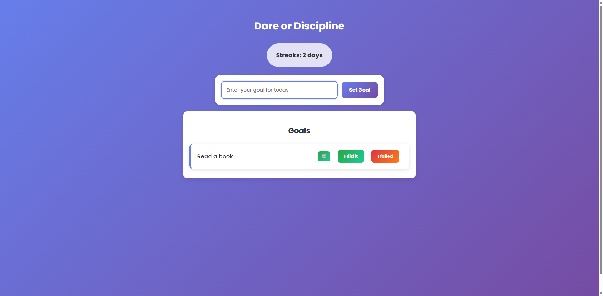

# Dare for Discipline 🧠🔥

A simple and fun **web app** that helps you stay accountable to your daily goals. If you fail to complete a goal, the app challenges you with a **DARE** to make up for it — because growth comes from discomfort 💪.

## 🚀 Features

- ✅ Set your daily goal
- 📋 View a list of your activities
- ⚠️ If you miss a goal, get a random dare to complete
- 🔁 Encourages consistency and builds discipline through accountability
- 💅 Clean, minimal, mobile-friendly UI using HTML, CSS, and JavaScript

## 🖼️ Preview



## 🛠️ Tech Stack

- HTML5
- CSS3 (with Google Fonts)
- Vanilla JavaScript

## 📂 How to Use

1. Clone or download this repository:
   ```bash
   git clone https://github.com/elbse/DoOrDare.git
